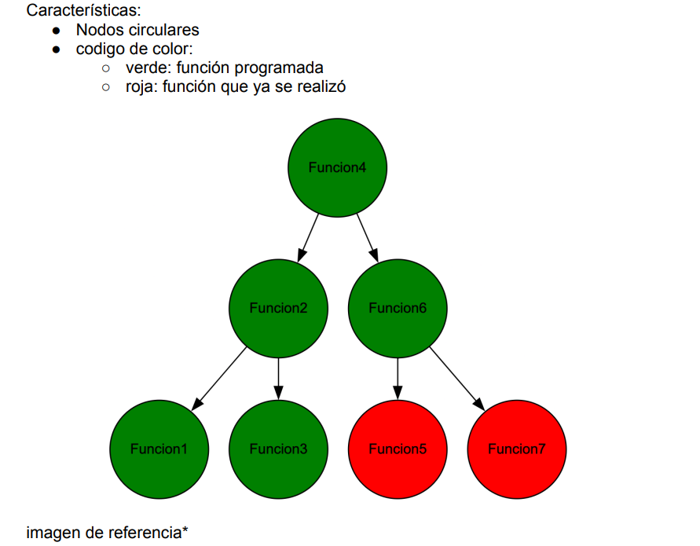
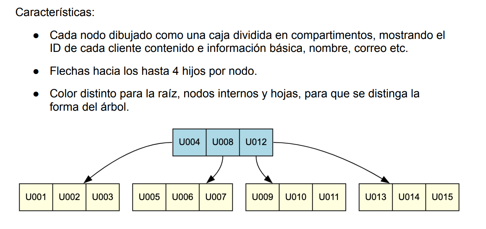
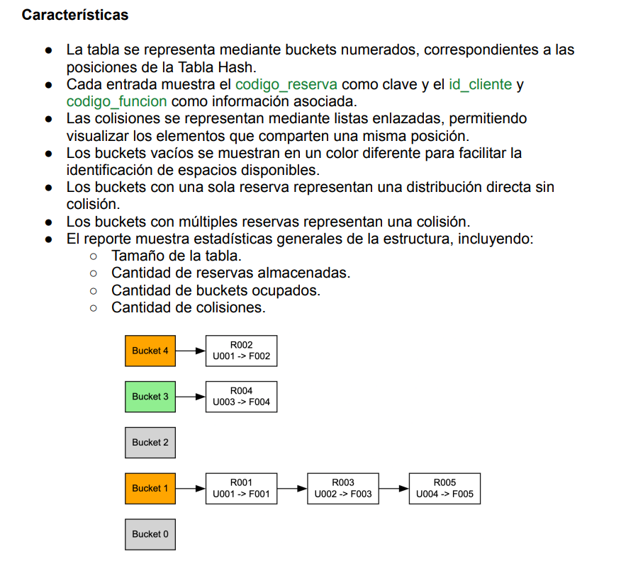

# **CINEMAUSAC**

CinemaUSAC es un proyecto enfocado a la administracion de un cine, el cual permite a los usuarios realizar la compra de boletos para las diferentes funciones que se encuentran disponibles en el cine, asi como consultar la cartelera de peliculas y horarios.

El objetivo principal de este proyecto es la implementacion de estructuras de datos dinamicas, para el manejo de la informacion de las peliculas, funciones y boletos, clientes 

## **DIFERENCIAS CON LA FASE 1**
A diferencia de la fase 1, se agregaron algunos cambios, nuevas estructuras y funcionalidades nuevas, algunas de ellas son:


- Ahora se pueden generar varias funciones a la vez, es decir, se crearan varias matrices dispersas y estas se gestionaran desde un arbol AVL, el cual permitira la busqueda de funciones de manera mas eficiente.

- Cada pelicula tendra 0, 1 o varias funciones asociadas, o viceversa cada funcion tendra una pelicula asociada.

- Por cada funcion se creara un archivo JSON que contendra la informacion de los asientos, los cuales se gestionaran mediante una matriz dispersa y a su vez se tomaran los datos para el arbol AVL de funciones. Cada JSON se almacenara en una carpeta llamada "Asientos", y cada JSON tendra el nomnre "F00X_funcion.json", los cuales almacenan los datos de los asientos ocupados.

- Ahora se tendra una persistencia en los datos, como peliculas, clientes, funciones, solicitudes etc, los cuales se guardaran en archivos JSON. Ademas que tambien se podra cargar los datos de archivos JSON externos.

- Se permitira tanto la creacion (mediante un registro de cada usuario) de usuarios, ademas de que el adminitrador podra cargar usuarios desde un archivo JSON externo.

- Los usarios se almacenaran en un arbol B de orden 4, que utiliza a el id del cliente (unico) como llave primaria, y se podra buscar, modificar y eliminar usuarios de manera eficiente.

- Para el almacenamiento de las reservas se utilizará una Tabla Hash general para
todo el sistema, utilizando codigo_reserva como clave y el objeto de la reserva como
valor. Esta elección se debe a que las reservas se consultan principalmente
mediante identificadores únicos, como al buscar, cancelar o consultar una reserva
específica. La Tabla Hash permitirá obtener directamente la reserva asociada a un
codigo_reserva, sin requerir que las reservas se encuentren ordenadas


## **IMPLEMENTACION DEL PROYECTO**
El proyecto se hizo, al igual que en la fase 1, en el lenguaje de programacion C++, utilizando la libreria de Qt para la interfaz grafica, con la implementacion de estructuras de datos dinamicas hechas especificamente para este proyecto, como lo son: Arbol AVL, Arbol B, Matriz Dispersa y Tabla Hash. Ademas de que se utilizo la libreria de JSON para la persistencia de los datos.


### **FORMATO DE LOS ARCHIVOS JSON**
Los archivos JSON utilizados para la persistencia de los datos, tienen el siguiente formato:

- **Peliculas y funciones**
```json
{
 "peliculas": [
    {
    "codigo": "P001",
    "titulo": "Avatar 3",
    "genero": "Ciencia Ficción",
    "duracion": 180,
    "clasificacion": "B15",
    "idioma": "Subtitulada",
    "fecha_estreno": "2026-01-15",
    "fecha_fin": "2026-03-15",
    "funciones": [
    {
        "codigo_funcion": "F001",
        "horario": "17:00",
        "sala": "Sala 2",
        "filas": 10,
        "columnas": 20,
        "archivo_asientos": ""
    }
 ]
 },
    {
    "codigo": "P002",
    "titulo": "Intensamente 2",
    "genero": "Animación",
    "duracion": 100,
    "clasificacion": "AA",
    "idioma": "Español",
    "fecha_estreno": "2026-02-01",
    "fecha_fin": "2026-04-01",
    "funciones": []
    }
 ]
}

```

- "Funciones y asientos"
  Como se menciono anteriormente, cada funcion tendra un archivo JSON independiente que contendra la informacion de los asientos, el cual tendra el siguiente formato:

```json
{
 "codigo_funcion": "F001",
 "asientos_ocupados": [
    {
    "fila": 2,
    "columna": 5,
    "codigo_reserva": "R001"
    }
    {
    "fila": 3,
    "columna": 4,
    "codigo_reserva": "R002"
    }
 ]
}
```

- **Clientes y reservas**
  Los clientes tendran varias reservas asociadas.

```json
{
 "clientes": [
    {
        "id": "U001",
        "nombre": "Juanito Alimaña",
        "correo": "Juanito@gmail.com",
        "telefono": "55551234",
        "password": "juanito123",
        "tipo": "cliente",
        "reservas": [
        {
            "codigo_reserva": "R001",
            "codigo_funcion": "F001",
            "fila": 2,
            "columna": 5,
            "fecha_reserva": "2026-03-01"
        }
      ]
    }
  ]
}
```
    
### **ESTRUCTURAS DE DATOS AGREGADAS PARA LA FASE 2**

**Arbol AVL de funciones**

  Se implemento un arbol AVL para el manejo de las funciones, el cual permite la busqueda de funciones de manera eficiente, ademas de que cada nodo del arbol contiene un puntero a una matriz dispersa que contiene la informacion de los asientos ocupados.

Las funciones se crean y eliminan con frecuencia
impredecible; el balance automático del árbol garantiza que buscar una función siga
siendo óptima aunque el catálogo de funciones crezca mucho. Por lo tanto las
funciones se almacenan en un árbol AVL independiente y el codigo_funcion será
utilizado como la clave.




**Arbol B de clientes**

Se implemento un arbol B de orden 4 para el manejo de los clientes, el cual permite labusqueda, modificacion y eliminacion de clientes de manera eficiente.

El arbol B de orden 4 permite almacenar hasta 3 claves por nodo y tener 4 hijos, lo que permite un manejo eficiente de los clientes, ya que se pueden almacenar muchos clientes en un solo nodo y mantener el arbol balanceado.

Esta estructura permite manejar múltiples
claves por nodo y mantener los clientes organizados por ID, facilitando las
operaciones de búsqueda, inserción, eliminación y los listados administrativos
ordenados. Cada cliente mantendrá únicamente las referencias mediante
codigo_reserva de las reservas que le pertenecen, evitando almacenar
repetidamente la información completa de cada reserva.





**Tabla Hash de reservas**
La tabla hash es utilizada para almacenar las reservas, utilizando el codigo_reserva como clave y el objeto de la reserva como valor. Esta estructura permite una busqueda eficiente de las reservas, ya que se puede acceder directamente a la reserva mediante su codigo_reserva. Esta elección se debe a que las reservas se consultan principalmente
mediante identificadores únicos, como al buscar, cancelar o consultar una reserva
específica




Por implementar:
Estructuras:
- Arbol AVL
- Arbol B
- Matriz Dispersa
- Carga de archivos Json
- Generacionde archivos Json para almacenar funciones


Mejoras:
- Mejorar el arbol Binario de Peliculas (no se estan guardado correctamente las peliculas)
- Mejorar la matriz dispersa (faltan mostrar los asientos no ocupados)
- Mejorar la forma en la que un cliente puede reservar asiento (ya sea por fila o columna o dando click sobre una casilla vacia)
- Mostrar advertencias cuando una pelicula ya esta por salir de cartelera

Validaciones:
- Si una funcion tiene un cliente con una reserva, no se puede eliminar la funcion
- Verificar si un cliente ya esxiste registrado con un correo

interfaz:
- Agregar un boton para generar el reporte de cada funcion en lugar de generarlo cuando se agrega algo.
- Registro de clientes
- lista de funciones disponibles

